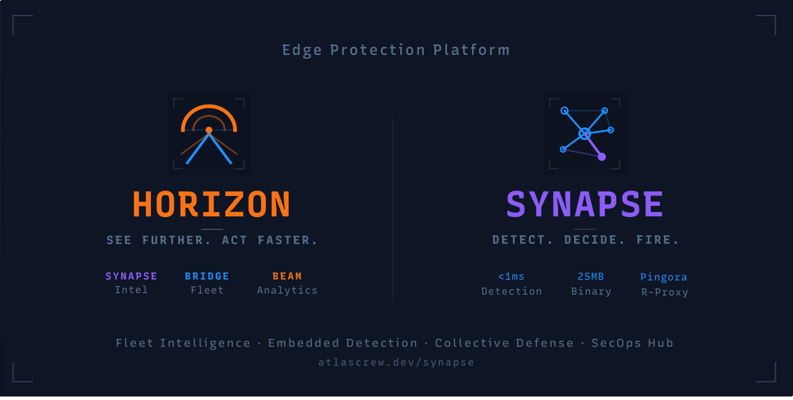

<p align="center">
  
</p>

<p align="center">
  <strong>Edge protection and fleet intelligence platform</strong><br/>
  <sub>A polyglot monorepo containing a Rust-based WAF/edge engine, a Node.js fleet intelligence API, a React dashboard, and supporting TypeScript libraries.</sub>
</p>

<p align="center">
  
  
  
  
  
</p>

<p align="center">
  <a href="https://horizon-demo.atlascrew.dev"><strong>Live Demo</strong></a> · <a href="https://atlascrew.dev">Documentation</a>
</p>

## Architecture

```
apps/
  signal-horizon/
    api/        → Fleet intelligence API (Node.js, Express, Prisma)
    ui/         → Dashboard (React 19, Vite, Tailwind)
    shared/     → Shared types and defaults
  synapse-waf/  → Edge WAF engine (Rust, Cloudflare Pingora)
  synapse-client/   → CLI and client for Synapse APIs (TypeScript)

packages/
  synapse-api/  → Reusable Synapse API client library (TypeScript)
```

**Synapse Fleet** (formerly Signal Horizon) is the fleet intelligence control plane — it aggregates telemetry from edge sensors, correlates attack campaigns, and drives collective defense decisions across a fleet of Synapse nodes.

**Synapse WAF** is a high-performance WAF and edge proxy built on Cloudflare's Pingora framework. It handles request inspection, entity tracking, risk scoring, DLP scanning, behavioral blocking, and campaign correlation at the edge.

## Install

### Docker (Recommended)

```bash
# Full platform
docker compose up -d   # see site docs for compose.yml

# Or run Synapse standalone
docker run -d -p 6190:6190 -p 6191:6191 \
  -v $(pwd)/config.yaml:/etc/synapse/config.yaml:ro \
  nickcrew/synapse-waf:latest
```

### npm

```bash
npm install -g @atlascrew/synapse-fleet  # Synapse Fleet server (formerly @atlascrew/horizon)
npm install -g @atlascrew/synapse-waf    # Synapse WAF
npm install -g @atlascrew/synapse-client # Synapse CLI

npm install @atlascrew/synapse-api       # Client library
```

See the [documentation site](https://atlascrew.dev) for full configuration and deployment guides.

---

## Development

> Everything below is for **contributors and developers** building from source.

## Prerequisites

| Tool | Version | Purpose |
|------|---------|---------|
| [Node.js](https://nodejs.org) | >= 20 | TypeScript projects |
| [pnpm](https://pnpm.io) | >= 10 | Package management |
| [Rust](https://rustup.rs) | nightly | Synapse WAF |
| [just](https://github.com/casey/just) | >= 1.0 | Task runner |
| [Redis](https://redis.io) | any | Session state, job queues |
| [PostgreSQL](https://www.postgresql.org) | >= 15 | Signal Horizon database |
| [ClickHouse](https://clickhouse.com) | >= 24 | Time-series telemetry (optional in dev) |

## Getting Started

### First-time setup

```bash
# 1. Start infrastructure services
brew services start redis       # Redis on :6379
open -a Postgres                # PostgreSQL on :5432 (or brew services start postgresql)
just ch-start                   # ClickHouse on :8123

# 2. Verify services are running
just services

# 3. Install dependencies
just install
pnpm rebuild esbuild prisma @prisma/client @prisma/engines

# 4. Set up databases
cp apps/signal-horizon/api/.env.example apps/signal-horizon/api/.env
# Edit .env — set DATABASE_URL to match your local PostgreSQL credentials
just db-generate                # Generate Prisma client
just db-migrate                 # Apply schema to PostgreSQL
just ch-init                    # Apply schema to ClickHouse
just db-seed                    # Seed tenants, sensors, and API keys
```

### Day-to-day

```bash
just dev                        # Start everything in parallel
```

After startup:

| Service | URL |
|---------|-----|
| Signal Horizon UI | <http://localhost:5180> |
| Signal Horizon API | <http://localhost:3100> |
| Synapse Proxy | <http://localhost:6190> |
| Synapse Admin API | <http://localhost:6191> |

The seed creates a default tenant with API key `dev-dashboard-key` — the UI uses this automatically, so no manual auth configuration is needed.

### Infrastructure services

```bash
just services                   # Check status of Redis, PostgreSQL, ClickHouse
just ch-start                   # Start ClickHouse (launchd)
just ch-stop                    # Stop ClickHouse
just ch-init                    # Initialize ClickHouse schema
```

## Development

All common tasks are available through the root `justfile`. Run `just` to see the full list.

### Dev Servers

```bash
just dev            # All services in parallel
just dev-horizon    # Signal Horizon API + UI only
just dev-synapse    # Synapse WAF only
```

### Build

```bash
just build                # All projects (Nx dependency graph)
just build-horizon        # Signal Horizon API + UI
just build-synapse        # Synapse WAF (release)
just build-synapse-dev    # Synapse WAF (debug, faster compile)
just build-synapse-api    # synapse-api library
just build-synapse-client # synapse-client CLI
```

### Test

```bash
just test               # Everything
just test-horizon       # Signal Horizon API + UI
just test-synapse       # Synapse WAF (cargo test)
just test-synapse-heavy # Synapse WAF integration tests
just test-synapse-api   # synapse-api library
just test-synapse-client # synapse-client CLI
```

### Lint & Type-Check

```bash
just lint           # ESLint + Clippy across all projects
just type-check     # TypeScript type-checking
just check-synapse  # Clippy + rustfmt check
just fmt-synapse    # Auto-format Rust code
```

### CI

```bash
just ci       # Full pipeline: lint → type-check → build → test
just ci-ts    # TypeScript projects only
just ci-rust  # Rust only (clippy, build, test)
```

### Database (Signal Horizon)

```bash
just db-migrate   # Run Prisma migrations (dev)
just db-seed      # Seed the database
just db-reseed    # Reset + reseed
just db-studio    # Open Prisma Studio
```

## Published Packages

| Package | Source | Registry |
|---------|--------|----------|
| nickcrew/synapse-fleet | `apps/signal-horizon/` | [Docker Hub](https://hub.docker.com/r/nickcrew/synapse-fleet) |
| nickcrew/synapse-waf | `apps/synapse-waf/` | [Docker Hub](https://hub.docker.com/r/nickcrew/synapse-waf) |
| @atlascrew/synapse-fleet | `apps/signal-horizon/` | [npm](https://www.npmjs.com/package/@atlascrew/synapse-fleet) |
| @atlascrew/synapse-waf | `apps/synapse-waf/` | [npm](https://www.npmjs.com/package/@atlascrew/synapse-waf) |
| @atlascrew/synapse-api | `packages/synapse-api/` | [npm](https://www.npmjs.com/package/@atlascrew/synapse-api) |
| @atlascrew/synapse-client | `apps/synapse-client/` | [npm](https://www.npmjs.com/package/@atlascrew/synapse-client) |
| synapse-waf | `apps/synapse-waf/` | [crates.io](https://crates.io/crates/synapse-waf) |

> **Note:** Synapse Fleet was previously published as `@atlascrew/horizon` / `nickcrew/horizon`. The old names are deprecated and will not receive new builds. The repo directory at `apps/signal-horizon/` is intentionally unchanged — see [ADR-0003](apps/signal-horizon/docs/architecture/adr-0003-synapse-fleet-rename.md).

## Workspace Tooling

- **[pnpm](https://pnpm.io)** — package management with workspaces
- **[Nx](https://nx.dev)** — build orchestration and dependency graph (`just graph` to visualize)
- **[just](https://github.com/casey/just)** — task runner (root `justfile`)
- **[Cargo](https://doc.rust-lang.org/cargo/)** — Rust build system (self-contained within `synapse-waf`)

Synapse WAF also has its own `justfile` at `apps/synapse-waf/justfile` with demo and service management recipes.

## License

| Component | License |
|-----------|---------|
| Synapse Fleet (API, UI) | [AGPL-3.0-only](LICENSE) |
| Synapse WAF | [AGPL-3.0-only](LICENSE) |
| @atlascrew/synapse-api | [MIT](packages/synapse-api/package.json) |
| @atlascrew/synapse-client | [MIT](apps/synapse-client/package.json) |
