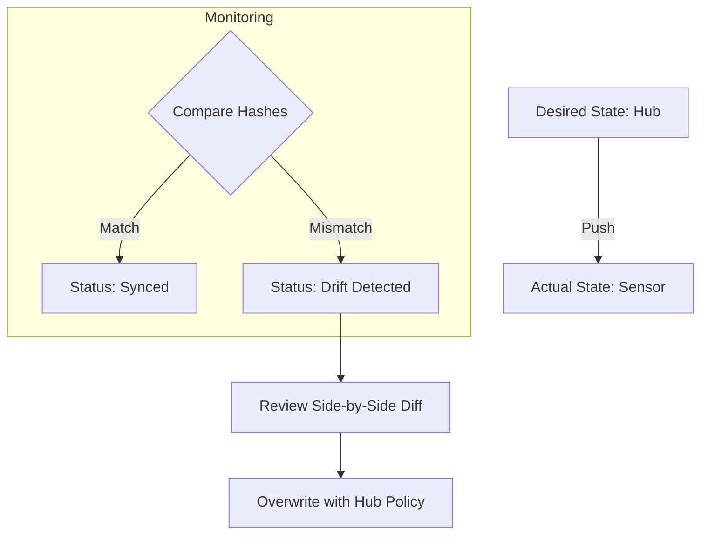

# Configuration Drift Management

This guide explains how to identify and remediate configuration mismatches between the Signal Horizon Hub and your edge sensors.

## Overview

Signal Horizon follows a **Desired State** model. You define the "Gold Standard" configuration in the Hub, and it is pushed to the sensors. **Config Drift** occurs when a manual change is made directly on a sensor (e.g., via SSH or local script), causing it to diverge from the Hub's authoritative policy.

## The Drift Detection Loop

## 1. How Drift is Detected
Sensors include a **Config Hash** in their heartbeats sent every 60 seconds. The Hub compares this hash against the expected hash of the current Desired State. If they differ, the sensor's status changes to **DRIFT DETECTED**.

## 2. Using the Drift Viewer
Navigate to the **Sensor Detail** page and select the **Drift Analysis** tab.
- **Expected (Desired)**: The configuration stored in Signal Horizon.
- **Actual (Live)**: The configuration reported by the sensor via the WebSocket tunnel.
- **The Diff**: Highlighted lines showing exactly which fields (e.g., WAF Threshold, Rate Limits) have been manually altered.

## 3. Remediating Drift

### Option A: Overwrite (Recommended)
If the local change was unauthorized or accidental:
1. Click **Save & Push Changes** from the **Configuration** tab.
2. The Hub will re-send the authoritative policy, forcing the sensor back into compliance.

### Option B: Local Override (Advanced)
If the local change was intentional (e.g., emergency hot-patch during an incident):
1. Copy the **Actual** values into the Hub's **Configuration** UI.
2. Save the change in the Hub.
3. The Desired State now matches the Actual State, and the "Drift Detected" alarm will clear.

## 4. Common Drift Scenarios

| Divergence | Possible Cause | Impact |
|------------|----------------|--------|
| **WAF Enabled = false** | Manual troubleshooting bypass. | **CRITICAL**: Sensor is not protecting traffic. |
| **RPS Limit = 5000** | Local script increased limit for stress test. | **WARNING**: Sensor may be overloaded. |
| **AllowList mismatch** | Local IP added to bypass a block. | **SECURITY**: Potential unauthorized access. |

## Best Practices
- **Role-Based Access**: Limit SSH access to sensors to prevent unauthorized local configuration.
- **Audit Logs**: Review the Audit Log in the Hub to see who pushed the last authorized configuration.
- **Regular Checks**: Periodically review the **Fleet Health** dashboard for "Drift Detected" indicators.

## Next Steps
- **[Fleet Configuration](../tutorials/fleet-configuration-management.md)**: Learn how to set the Desired State.
- **[Remote Shell](./remote-shell.md)**: Use the browser shell to safely inspect sensor logs when drift is detected.
