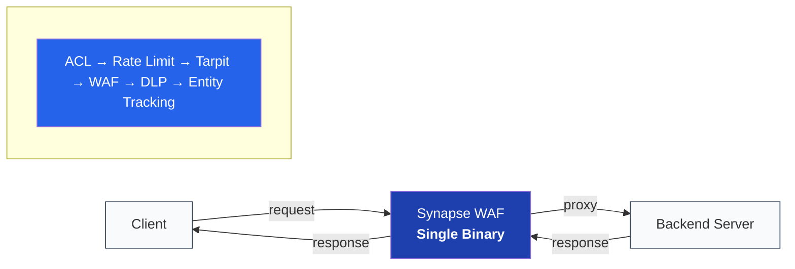

# Synapse WAF

High-performance Web Application Firewall and reverse proxy with embedded intelligence, built on Cloudflare's [Pingora](https://github.com/cloudflare/pingora) framework. Single Rust binary, sub-millisecond detection, 237 production rules.

## Performance

| Metric | Result |
|--------|--------|
| **Simple GET detection** | **~10 μs** |
| **Full pipeline** (ACL, rate limit, WAF, entity tracking) | **~72 μs** |
| **WAF + DLP** (4 KB body) | **~247 μs** |
| **Full stack E2E** | **~450 μs** |
| **Sustained throughput** | **72K req/s** |
| **DLP throughput** | **188 MiB/s** |
| Production rules | **237** (sub-linear scaling) |

> Criterion.rs benchmarks on Apple M3 Pro. See the
> [full benchmark report](docs/performance/BENCHMARK_REPORT_2026_02.md) and
> [methodology](docs/performance/BENCHMARK_METHODOLOGY.md) for details.

## Architecture



Every request is fully inspected — ACL, rate limiting, WAF rule evaluation, entity tracking, DLP scanning, campaign correlation, and behavioral profiling — in a single process with no serialization boundaries.

## Features

### Detection

- **WAF engine** — 237 production rules covering SQLi, XSS, path traversal, command injection, and evasion techniques (hex, double-encoding, unicode, polyglot). Indexed rule selection for sub-linear scaling.
- **DLP scanning** — 25 sensitive data patterns (credit cards with Luhn validation, SSN, IBAN, API keys, JWT, RSA/EC private keys, medical records). Aho-Corasick multi-pattern optimization, configurable inspection depth cap, content-type short-circuit for binary payloads.
- **Credential stuffing detection** — Login endpoint monitoring with rate tracking, distributed attack correlation, and cross-fingerprint analysis.
- **Crawler and bot detection** — 46 malicious bot signatures and 19 known crawler definitions with reverse DNS verification for legitimate crawlers. Configurable TTL cache.
- **API profiling** — Endpoint schema learning with anomaly detection for unusual parameter counts, payload sizes, and content types.

### Intelligence

- **Entity tracking** — Per-IP risk scoring with behavioral decay, LRU eviction, and configurable thresholds. Risk accumulates across requests and decays over time.
- **Actor tracking** — Behavioral fingerprinting and state management across sessions.
- **Session management** — Session hijacking detection with cookie-based validation.
- **Campaign correlation** — Attack campaign identification via fingerprint clustering across IPs.
- **Trend analysis** — Request and signal trend tracking with anomaly detection.
- **GeoIP** — Impossible travel detection for login events.

### Protection

- **Rate limiting** — Per-IP token-bucket with burst capacity, per-site overrides.
- **Access lists** — CIDR-based allow/deny rules per site, IPv4 and IPv6.
- **Tarpit** — Progressive response delays for suspicious actors (configurable base, max, and multiplier).
- **Trap endpoints** — Honeypot paths that flag reconnaissance activity.
- **Interrogator** — Progressive challenge escalation: JS challenge, CAPTCHA, proof-of-work, then block. HMAC-signed cookies for session continuity.
- **SNI validation** — Domain fronting prevention via TLS/HTTP hostname cross-check.

### Operations

- **Multi-site support** — Hostname-based virtual host routing with per-site WAF thresholds, rate limits, access lists, block pages, and TLS certificates.
- **Admin API** — 90+ endpoints for configuration, diagnostics, WAF statistics, entity/actor intelligence, campaign views, and more. See the [Admin API reference](docs/api/admin-api.md).
- **Hot reload** — Configuration updates via `POST /reload` with ~240 μs atomic swap. No dropped requests.
- **Graceful shutdown** — SIGQUIT/SIGTERM/SIGINT handling with in-flight request draining and configurable timeout.
- **Shadow mirroring** — Mirror traffic to a honeypot backend with rate-limited sampling.
- **Signal Horizon** — Fleet-wide threat intelligence sharing via WebSocket hub.
- **Secure tunnel** — Encrypted tunnel client for agent-to-hub connectivity.

### Observability

- **Prometheus metrics** — Requests, blocks, latencies, WAF, DLP, crawler, entity, tarpit, and system metrics at `/metrics`. See the [metrics reference](docs/observability/PROMETHEUS_METRICS.md).
- **Health endpoint** — `GET /_sensor/status` for load balancer integration.
- **Web console** — Built-in admin dashboard at `/console`.
- **TUI dashboard** — Interactive terminal UI with `--tui` flag.
- **Access and block logging** — JSON or text format with detection timing.
- **Diagnostic bundle** — Export full system state via the admin API.

## Quick Start

```bash
# Build
cargo build --release

# Configure
cp config.example.yaml config.yaml
# Edit config.yaml with your upstream backends

# Run
./target/release/synapse-waf

# Run with terminal dashboard
./target/release/synapse-waf --tui

# Validate configuration
./target/release/synapse-waf check-config config.yaml
```

## Configuration

```yaml
server:
  listen: "0.0.0.0:6190"
  workers: 0                      # 0 = auto-detect CPU count

upstreams:
  - host: "127.0.0.1"
    port: 8080

rate_limit:
  rps: 10000
  enabled: true

detection:
  sqli: true
  xss: true
  path_traversal: true
  command_injection: true
  action: "block"                 # block, log, challenge
  block_status: 403

dlp:
  enabled: false
  max_body_inspection_bytes: 8192 # 8 KB inspection cap
  scan_text_only: true
  action: "mask"                  # mask, hash, block, log

tls:
  enabled: false
  min_version: "1.2"

logging:
  level: "info"
  format: "text"
  access_log: true
```

See [`docs/reference/configuration.md`](docs/reference/configuration.md) for the full reference including per-site overrides, crawler detection, tarpit, profiler, trap endpoints, and Signal Horizon integration.

## Usage Examples

### Clean request (proxied)

```bash
curl -v http://localhost:6190/api/users/123
# → Proxied to backend
# → X-Synapse-Analyzed: true
# → X-Synapse-Detection-Time-Us: 1
```

### SQL injection (blocked)

```bash
curl -v "http://localhost:6190/api/users?id=1'+OR+'1'%3D'1"
# → HTTP 403 Forbidden
# → {"error": "blocked", "reason": "sqli"}
```

### Admin API

```bash
# Health check
curl http://localhost:6191/health

# Hot reload
curl -X POST http://localhost:6191/reload -H "X-Admin-Key: $ADMIN_KEY"

# WAF statistics
curl http://localhost:6191/waf/stats -H "X-Admin-Key: $ADMIN_KEY"

# Dry-run evaluation
curl -X POST http://localhost:6191/_sensor/evaluate \
  -H "X-Admin-Key: $ADMIN_KEY" \
  -H "Content-Type: application/json" \
  -d '{"method": "GET", "path": "/test?id=1 OR 1=1"}'
```

## Benchmarks (February 2026)

19 Criterion.rs suites, ~306 benchmarks. Release profile with LTO.

### Detection Engine

| Technique | Latency |
|-----------|---------|
| Simple GET | 10.0 μs |
| Path traversal (all variants) | 10-12 μs |
| XSS (hex/double/unicode evasion) | 26-28 μs |
| SQLi (comment/case/concat evasion) | 30-32 μs |
| Command injection (backtick) | 33 μs |
| Polyglot XSS+SQLi | 25.7 μs |
| Full rule set (237 rules) | 71.8 μs |

All evasion payloads detected under 34 μs.

### Hot Path

| Component | Latency |
|-----------|---------|
| Rate limit check | 50-64 ns |
| ACL (5 rules, first hit) | 5 ns |
| ACL (100 rules, last hit) | 156 ns |
| IPv6 CIDR match | 6 ns |
| Trap match | 33 ns |
| Tarpit peek | 36-59 ns |
| Actor is-blocked | 45 ns |
| Session validate (existing) | 304 ns |
| Domain validation | 75 ns |

### Realistic Scenarios

| Scenario | Latency |
|----------|---------|
| Simple GET | 10.0 μs |
| Heavy request (14 KB + 20 headers) | 1.46 ms |
| E-commerce order | 1.61 ms |
| GraphQL mutation | 1.61 ms |
| Healthcare claim (PII + DLP) | 2.26 ms |
| Bulk import | 5.43 ms |

### Full Stack Latency Budget

Pipeline (72 μs) + Trends (96 μs) + Campaign (65 μs) + DLP (34 μs) + Crawler (3 μs) + Session (7 μs) + Profiler (1 μs) + Proxy (~150 μs) = **~428 μs worst-case**.

Measured WAF+DLP combined: 247 μs (4 KB) / 442 μs (8 KB) — work sharing reduces actual cost below sum of parts.

## Building

```bash
# Development
cargo build

# Release (optimized)
cargo build --release

# With native CPU targeting
RUSTFLAGS="-C target-cpu=native" cargo build --release

# Tests
cargo test

# Audit #[serial] coverage for tests that touch the global SYNAPSE engine
bash scripts/check-synapse-test-serial.sh
# Fails with any test function missing #[serial] after it touches DetectionEngine,
# the filter entry points, the SynapseProxy singleton constructors, or the
# global SYNAPSE singleton directly.
# Fix failures by adding #[serial] from serial_test::serial above the affected test.

# Benchmarks
cargo bench
```

## Documentation

| Document | Description |
|----------|-------------|
| [Configuration Reference](docs/reference/configuration.md) | Full configuration options |
| [Admin API Reference](docs/api/admin-api.md) | 90+ management endpoints |
| [Prometheus Metrics](docs/observability/PROMETHEUS_METRICS.md) | 50+ exported metrics |
| [Benchmark Report](docs/performance/BENCHMARK_REPORT_2026_02.md) | February 2026 benchmark results |
| [Benchmark Methodology](docs/performance/BENCHMARK_METHODOLOGY.md) | How benchmarks are run |
| [Reproducing Benchmarks](docs/performance/REPRODUCING_BENCHMARKS.md) | Run benchmarks locally |
| [Advanced Threat Detection](docs/architecture/ADVANCED_THREAT_DETECTION.md) | Trap endpoints, session tracking, JA4 |

## License

Licensed under the GNU Affero General Public License v3.0 only.
Copyright Nicholas Crew Ferguson.
See [LICENSE](../../LICENSE).
