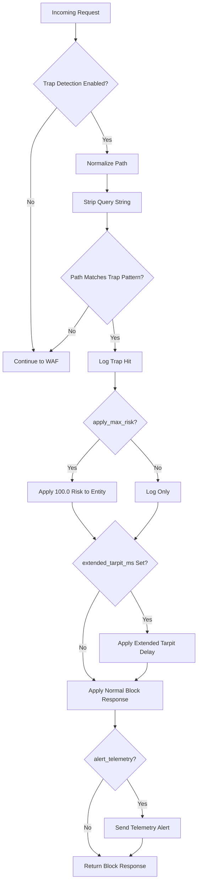
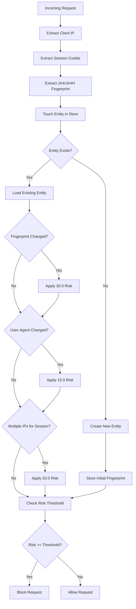
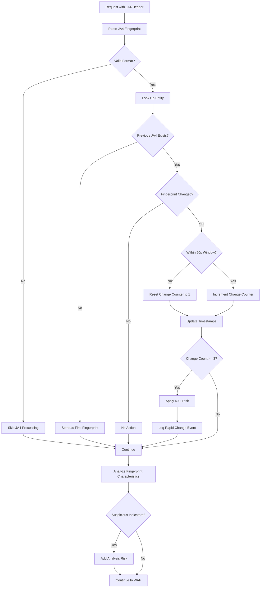
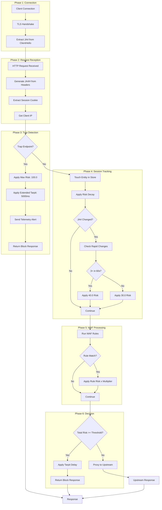

# Advanced Threat Detection in Synapse-Pingora

This document describes the three advanced security features integrated into Synapse-Pingora for sophisticated threat detection beyond traditional signature-based WAF rules.

## Table of Contents

1. [Honeypot/Trap Endpoints](#honeypoттrap-endpoints)
2. [Session Tracking Integration](#session-tracking-integration)
3. [JA4 Fingerprint Reputation](#ja4-fingerprint-reputation)
4. [Request Processing Flow](#request-processing-flow)
5. [Configuration Reference](#configuration-reference)
6. [Integration Examples](#integration-examples)

---

## Honeypot/Trap Endpoints

### Overview

Trap endpoints are decoy paths that legitimate users would never access. They serve as early warning indicators of reconnaissance and automated scanning activity. Any client accessing a trap path receives immediate maximum risk scoring, effectively identifying malicious actors before they can find real vulnerabilities.

### Why Trap Endpoints Matter

1. **Early Detection**: Attackers typically scan for common sensitive files before launching targeted attacks
2. **Zero False Positives**: Legitimate users have no reason to access `/.git/config` or `/wp-admin/` on an API server
3. **Immediate Identification**: A single trap hit reveals an attacker's entire session
4. **Resource Exhaustion**: Combined with tarpit delays, trap endpoints slow down automated scanners

### TrapConfig Options

```rust
pub struct TrapConfig {
    /// Whether trap detection is enabled (default: true)
    pub enabled: bool,

    /// Path patterns to match as traps (glob syntax)
    pub paths: Vec<String>,

    /// Apply maximum risk (100.0) on trap hit (default: true)
    pub apply_max_risk: bool,

    /// Extended tarpit delay in milliseconds (default: 5000ms)
    pub extended_tarpit_ms: Option<u64>,

    /// Send telemetry alerts on trap hits (default: true)
    pub alert_telemetry: bool,
}
```

### Default Trap Paths

The following paths are monitored by default:

| Pattern | Description | Attack Type |
|---------|-------------|-------------|
| `/.git/*` | Git repository exposure | Source code theft |
| `/.env` | Environment file exposure | Credential theft |
| `/.env.*` | Environment variants | Credential theft |
| `/admin/backup*` | Admin backup files | Data exfiltration |
| `/wp-admin/*` | WordPress admin | CMS exploitation |
| `/phpmyadmin/*` | Database admin | Database access |
| `/.svn/*` | SVN repository | Source code theft |
| `/.htaccess` | Apache config | Configuration leak |
| `/web.config` | IIS config | Configuration leak |
| `/config.php` | PHP config files | Credential theft |

### Glob Pattern Syntax

- `*` - Matches any characters except `/`
- `**` - Matches any characters including `/`
- `?` - Matches exactly one character

Examples:
```yaml
paths:
  - "/.git/*"           # Matches /.git/config but not /.git/objects/pack/file
  - "/admin/**"         # Matches /admin/backup/db.sql (recursive)
  - "/secret?.txt"      # Matches /secret1.txt but not /secret12.txt
```

### Risk Scoring

When `apply_max_risk: true` (default), trap hits immediately apply:

- **Risk Score**: 100.0 (maximum)
- **Block Decision**: Immediate block (threshold typically 70.0)
- **Tarpit Delay**: 5000ms extended delay (configurable)

### Trap Detection Flow



---

## Session Tracking Integration

### Overview

Session tracking enables behavioral analysis across multiple requests from the same client. By correlating requests using IP addresses, cookies, and fingerprints, the system can detect anomalies that indicate session hijacking, credential stuffing, or bot behavior.

### How SessionStore Works with Engine

The `EntityManager` provides thread-safe, lock-free session tracking using DashMap for high-RPS WAF scenarios:

```rust
pub struct EntityManager {
    /// Entities by IP address (lock-free concurrent map)
    entities: DashMap<String, EntityState>,
    /// Configuration
    config: EntityConfig,
    /// Metrics
    total_created: AtomicU64,
    total_evicted: AtomicU64,
}
```

### Entity State Structure

Each tracked entity maintains:

```rust
pub struct EntityState {
    pub entity_id: String,           // IP address (primary key)
    pub risk: f64,                   // Accumulated risk (0.0-100.0)
    pub first_seen_at: u64,          // First request timestamp
    pub last_seen_at: u64,           // Last request timestamp
    pub request_count: u64,          // Total requests
    pub blocked: bool,               // Block status
    pub blocked_reason: Option<String>,
    pub matches: HashMap<u32, RuleMatchHistory>,  // Rule match history
    pub ja4_fingerprint: Option<String>,          // Current JA4
    pub previous_ja4: Option<String>,             // Previous JA4 (for change detection)
    pub ja4_change_count: u32,                    // Changes within window
    pub last_ja4_change_ms: Option<u64>,          // Last change timestamp
}
```

### Anomaly Detection Signals

The session tracking system detects three primary anomalies:

#### 1. Fingerprint Changed (`fingerprint_changed`)

**Risk Score: 30.0**

Detects when a client's TLS/HTTP fingerprint changes mid-session, which may indicate:
- Session cookie theft
- Proxy or VPN switching
- Man-in-the-middle attack

```rust
// Detection logic
if current_fingerprint != previous_fingerprint {
    apply_anomaly_risk(ip, "fingerprint_changed", 30.0, None);
}
```

#### 2. Multiple IPs (`multiple_ips`)

**Risk Score: 20.0**

Detects when the same session identifier appears from different IP addresses:
- Session token reuse across networks
- Credential stuffing with shared sessions
- Bot network coordination

#### 3. User Agent Changed (`user_agent_changed`)

**Risk Score: 15.0**

Detects mid-session User-Agent changes:
- Bot frameworks with inconsistent headers
- Session hijacking with different browser
- Automated tools cycling User-Agents

### Cookie Extraction

The system extracts session cookies to correlate requests:

```rust
// Cookie header parsing for session correlation
let session_id = request.headers
    .iter()
    .find(|(name, _)| name.to_lowercase() == "cookie")
    .and_then(|(_, value)| {
        value.split(';')
            .find(|c| c.trim().starts_with("session="))
            .map(|c| c.split('=').nth(1).unwrap_or(""))
    });
```

### Session Anomaly Detection Flow



### Repeat Offender Multiplier

The system tracks rule match history and applies progressive multipliers:

| Match Count | Multiplier | Effective Risk |
|-------------|------------|----------------|
| 1 | 1.0x | Base risk |
| 2-5 | 1.25x | +25% |
| 6-10 | 1.5x | +50% |
| 11+ | 2.0x | +100% |

```rust
pub fn repeat_multiplier(count: u32) -> f64 {
    match count {
        0..=1 => 1.0,
        2..=5 => 1.25,
        6..=10 => 1.5,
        _ => 2.0,
    }
}
```

### Risk Decay

Risk scores decay over time to allow legitimate users to recover:

- **Decay Rate**: 10.0 points per minute (configurable)
- **Minimum Decay Interval**: 1 second (optimization)
- **Automatic Unblock**: When risk falls below threshold

---

## JA4 Fingerprint Reputation

### What JA4/JA4H Fingerprints Are

JA4+ is a suite of network fingerprinting methods that create stable, human-readable identifiers for clients based on their TLS and HTTP characteristics.

#### JA4 (TLS Fingerprint)

Created from the TLS ClientHello message:

```
t13d1516h2_8daaf6152771_e5627efa2ab1
│││ │ │ │  │              │
│││ │ │ │  │              └─ Extension hash (SHA256, first 12 chars)
│││ │ │ │  └─ Cipher hash (SHA256, first 12 chars)
│││ │ │ └─ ALPN protocol (h2 = HTTP/2)
│││ │ └─ Extension count (hex)
│││ └─ Cipher count (hex)
││└─ SNI type (d=domain, i=IP, empty=none)
│└─ TLS version (13 = 1.3)
└─ Protocol (t=TCP, q=QUIC)
```

#### JA4H (HTTP Fingerprint)

Created from HTTP request headers:

```
ge11cnrn_a1b2c3d4e5f6_000000000000
│ │ ││││  │              │
│ │ ││││  │              └─ Cookie names hash
│ │ ││││  └─ Header names hash
│ │ │││└─ Accept-Language (first 2 chars, or "00")
│ │ ││└─ Referer present (r=yes, n=no)
│ │ │└─ Cookie present (c=yes, n=no)
│ │ └─
│ └─ HTTP version (11 = 1.1, 20 = 2.0)
└─ Method code (ge=GET, po=POST, etc.)
```

### Why Fingerprints Matter

1. **Persistence**: Fingerprints remain stable across IP rotation
2. **Bot Detection**: Bots often have distinctive fingerprint patterns
3. **Correlation**: Link requests from the same client across sessions
4. **Evasion Detection**: Rapid fingerprint changes indicate tooling

### Rapid Change Detection

**Threshold**: 3+ fingerprint changes within 60 seconds = **40.0 risk**

This detects:
- Automated tools cycling through TLS configurations
- Bot frameworks with fingerprint randomization
- Proxy chains with different TLS termination

```rust
pub fn check_ja4_reputation(
    &self,
    ip: &str,
    current_ja4: &str,
    now_ms: u64,
) -> Option<Ja4ReputationResult> {
    const RAPID_CHANGE_WINDOW_MS: u64 = 60_000;  // 1 minute
    const RAPID_CHANGE_THRESHOLD: u32 = 3;       // 3+ changes

    // Detection logic...
    if change_count >= RAPID_CHANGE_THRESHOLD {
        return Some(Ja4ReputationResult {
            rapid_changes: true,
            change_count,
        });
    }
}
```

### JA4 Analysis

The system analyzes fingerprints for suspicious characteristics:

| Indicator | Risk Signal |
|-----------|-------------|
| TLS < 1.2 | Deprecated protocol (critical risk) |
| Missing ALPN with TLS 1.3 | Unusual for browsers |
| Cipher count < 5 | Likely script or bot |
| Extension count < 5 | Likely script or bot |
| No Accept-Language | Bot or API client |
| HTTP/1.0 | Very rare, likely script |

### Bot Behavior Indicators

Common patterns that suggest automated traffic:

1. **Minimal TLS Configuration**: Low cipher/extension counts
2. **Missing Browser Headers**: No Accept-Language, no Referer
3. **Protocol Mismatches**: TLS 1.3 but HTTP/1.0
4. **Rapid Fingerprint Changes**: Multiple different fingerprints per minute
5. **Known Bot Signatures**: Specific cipher hash patterns

### JA4 Reputation Algorithm



---

## Request Processing Flow

This diagram shows how all three features integrate into the request processing pipeline:



---

## Configuration Reference

### Complete YAML Configuration Example

```yaml
# synapse-pingora configuration with advanced threat detection

server:
  http_addr: "0.0.0.0:80"
  https_addr: "0.0.0.0:443"
  workers: 0  # Auto-detect CPU count
  waf_threshold: 70
  waf_enabled: true
  log_level: info

  # Honeypot trap configuration
  trap_config:
    enabled: true
    paths:
      # Default paths (automatically included)
      - "/.git/*"
      - "/.env"
      - "/.env.*"
      - "/admin/backup*"
      - "/wp-admin/*"
      - "/phpmyadmin/*"
      - "/.svn/*"
      - "/.htaccess"
      - "/web.config"
      - "/config.php"
      # Custom paths for your application
      - "/api/internal/**"
      - "/debug/*"
      - "/.aws/credentials"
      - "/id_rsa*"
    apply_max_risk: true
    extended_tarpit_ms: 5000
    alert_telemetry: true

# Entity tracking configuration
entity:
  enabled: true
  max_entities: 100000
  risk_decay_per_minute: 10.0
  block_threshold: 70.0
  max_rules_per_entity: 50
  max_risk: 100.0
  max_anomalies_per_entity: 100

# Tarpit configuration
tarpit:
  enabled: true
  base_delay_ms: 1000
  max_delay_ms: 30000
  progressive_multiplier: 1.5
  max_states: 10000
  decay_threshold_ms: 300000    # 5 minutes
  cleanup_threshold_ms: 1800000  # 30 minutes

# Global rate limiting
rate_limit:
  rps: 10000
  enabled: true
  burst: 20000

# Site configurations
sites:
  - hostname: api.example.com
    upstreams:
      - host: 127.0.0.1
        port: 8080
        weight: 1
    tls:
      cert_path: /etc/certs/api.example.com.pem
      key_path: /etc/certs/api.example.com.key
      min_version: "1.2"
    waf:
      enabled: true
      threshold: 60  # Stricter than global
    rate_limit:
      rps: 1000
      enabled: true
```

### Environment Variables

```bash
# Enable/disable features
export USE_PINGORA_ENTITIES=true
export ENABLE_PINGORA_JA4=true
export ENABLE_PINGORA_TARPIT=true

# Dual-running mode (comparison headers)
export DUAL_RUNNING_MODE=true
```

---

## Integration Examples

### Rust Integration

#### Initializing the Trap Matcher

```rust
use synapse_pingora::trap::{TrapConfig, TrapMatcher};

// Use default configuration
let trap_matcher = TrapMatcher::new(TrapConfig::default())?;

// Or customize paths
let custom_config = TrapConfig {
    enabled: true,
    paths: vec![
        "/.git/*".to_string(),
        "/.env".to_string(),
        "/api/internal/**".to_string(),
    ],
    apply_max_risk: true,
    extended_tarpit_ms: Some(5000),
    alert_telemetry: true,
};
let trap_matcher = TrapMatcher::new(custom_config)?;
```

#### Checking for Trap Hits

```rust
// In request handler
let path = request.uri().path();

if trap_matcher.is_trap(path) {
    // Get the matched pattern for logging
    let pattern = trap_matcher.matched_pattern(path);
    tracing::warn!(
        path = %path,
        pattern = ?pattern,
        "Trap endpoint accessed"
    );

    // Apply maximum risk
    if trap_matcher.config().apply_max_risk {
        entity_manager.apply_anomaly_risk(
            client_ip,
            "honeypot_hit",
            100.0,
            Some(path),
        );
    }

    // Apply extended tarpit
    if let Some(delay_ms) = trap_matcher.config().extended_tarpit_ms {
        tokio::time::sleep(Duration::from_millis(delay_ms)).await;
    }

    return block_response(403, "Forbidden");
}
```

#### Session Tracking Integration

```rust
use synapse_pingora::entity::{EntityManager, EntityConfig};

// Initialize entity manager
let entity_manager = EntityManager::new(EntityConfig {
    max_entities: 100_000,
    risk_decay_per_minute: 10.0,
    block_threshold: 70.0,
    ..Default::default()
});

// Touch entity on each request
let snapshot = entity_manager.touch_entity_with_fingerprint(
    client_ip,
    ja4_fingerprint.as_deref(),
    combined_hash.as_deref(),
);

// Check JA4 reputation
if let Some(ja4) = &ja4_fingerprint {
    if let Some(reputation) = entity_manager.check_ja4_reputation(
        client_ip,
        ja4,
        now_ms(),
    ) {
        if reputation.rapid_changes {
            entity_manager.apply_anomaly_risk(
                client_ip,
                "ja4_rapid_change",
                40.0,
                Some(&format!("{} changes in 60s", reputation.change_count)),
            );
        }
    }
}

// Check block decision
let decision = entity_manager.check_block(client_ip);
if decision.blocked {
    return block_response(403, decision.reason.as_deref().unwrap_or("Blocked"));
}
```

#### JA4 Fingerprint Processing

```rust
use synapse_pingora::fingerprint::{
    parse_ja4_from_header,
    generate_ja4h,
    extract_client_fingerprint,
    analyze_ja4,
    HttpHeaders,
};

// Parse JA4 from upstream header
let ja4_header = request.headers().get("X-JA4-Fingerprint");
let ja4 = parse_ja4_from_header(ja4_header.map(|h| h.to_str().ok()).flatten());

// Generate JA4H from request
let headers: Vec<(String, String)> = request.headers()
    .iter()
    .map(|(k, v)| (k.to_string(), v.to_str().unwrap_or("").to_string()))
    .collect();

let http_headers = HttpHeaders {
    headers: &headers,
    method: request.method().as_str(),
    http_version: "1.1",
};

let ja4h = generate_ja4h(&http_headers);

// Analyze for suspicious characteristics
if let Some(ref fp) = ja4 {
    let analysis = analyze_ja4(fp);
    if analysis.suspicious {
        tracing::info!(
            fingerprint = %fp.raw,
            client = %analysis.estimated_client,
            issues = ?analysis.issues,
            "Suspicious JA4 fingerprint detected"
        );
    }
}
```

### HTTP Response Headers

The system injects diagnostic headers in dual-running mode:

```http
X-Entity-Risk-Pingora: 45.0
X-Entity-Blocked-Pingora: false
X-Tarpit-Delay-Pingora-Ms: 1500
X-Tarpit-Level-Pingora: 3
X-JA4-Fingerprint: t13d1516h2_8daaf6152771_e5627efa2ab1
X-JA4H-Fingerprint: ge11cnrn_a1b2c3d4e5f6_aabbccddeeff
X-Client-Fingerprint: 0a1b2c3d4e5f6789
```

---

## Summary

The three advanced threat detection features work together to provide defense-in-depth:

| Feature | Detection Method | Risk Applied | Purpose |
|---------|------------------|--------------|---------|
| **Trap Endpoints** | Path matching | 100.0 (max) | Catch scanners/recon |
| **Session Tracking** | Behavioral analysis | 15.0-30.0 | Detect anomalies |
| **JA4 Reputation** | Fingerprint changes | 40.0 | Identify bots/tools |

Combined with traditional WAF rules and rate limiting, these features enable comprehensive threat detection that adapts to attacker behavior in real-time.
