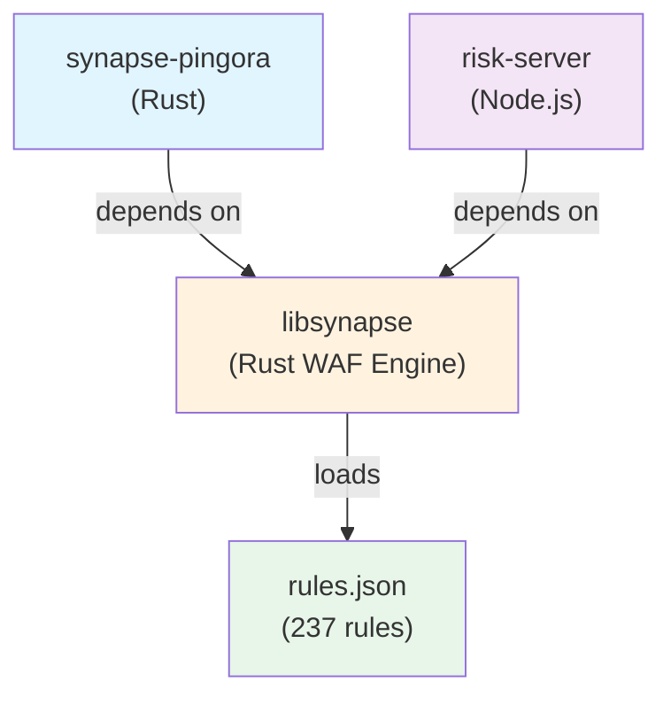

# Synapse-Pingora Integration with Risk-Server

**Date**: January 7, 2026
**Version**: 1.0
**Scope**: Architecture, code dependencies, and deployment relationship

---

## TL;DR - Quick Answer

**synapse-pingora** integrates with **risk-server** at one point:

```
synapse-pingora (Rust/Pingora proxy)
    ↓ depends on
libsynapse (Rust WAF rule engine - 237 rules)
    ↓ lives in
../risk-server/libsynapse/
```

They share the **same WAF rule engine (libsynapse)** but are deployed as **separate applications**:

| Component | Tech Stack | Purpose | Deployment |
|-----------|-----------|---------|-----------|
| **risk-server** | Node.js | Demo sensor with TUI dashboard | `npm run dev` on port 4100 |
| **synapse-pingora** | Rust/Pingora | High-performance proxy WAF | `cargo run --release` on port 6190 |
| **libsynapse** | Rust library | Shared 237-rule detection engine | `../risk-server/libsynapse/` |

---

## Part 1: The Architecture

### 1.1 High-Level Overview

```
┌─────────────────────────────────────────────────────────────┐
│               Atlas Crew Monorepo                         │
└─────────────────────────────────────────────────────────────┘

apps/
├── risk-server/                    # Node.js Demo Sensor
│   ├── dashboard-ui/               # Web dashboard (React)
│   ├── tui/                        # Terminal dashboard (blessed)
│   ├── libsynapse/                 # ★ SHARED WAF ENGINE ★
│   │   ├── src/
│   │   │   ├── engine.rs           # Core detection (237 rules)
│   │   │   ├── entity.rs           # IP risk tracking
│   │   │   ├── actor.rs            # Per-IP fingerprinting
│   │   │   ├── profile.rs          # Endpoint anomaly detection
│   │   │   └── ... (13 modules)
│   │   ├── rules.json              # 237 WAF rules
│   │   └── Cargo.toml
│   ├── native/                     # Node.js bindings
│   └── package.json
│
├── synapse-pingora/                # ★ Rust/Pingora WAF ★
│   ├── src/
│   │   ├── main.rs                 # Pingora HTTP proxy
│   │   ├── config_manager.rs       # Site/WAF configuration
│   │   ├── api.rs                  # Control plane API
│   │   └── ... (10+ modules)
│   ├── benches/
│   │   └── detection.rs            # 426ns benchmark
│   ├── Cargo.toml                  # ← Depends on libsynapse!
│   └── docs/
│       ├── BENCHMARK_METHODOLOGY.md
│       ├── BENCHMARK_COST_BREAKDOWN.md
│       └── INTEGRATION_WITH_RISK_SERVER.md  (this file)
│
└── ... other apps ...
```

### 1.2 Dependency Graph



---

## Part 2: The Shared Component - libsynapse

### 2.1 What is libsynapse?

`libsynapse` is the **core WAF detection engine**, written in pure Rust. It's shared between risk-server and synapse-pingora.

**Location**: `apps/risk-server/libsynapse/`

**Purpose**:
- Parse and compile 237 WAF rules from JSON
- Evaluate requests against those rules
- Track per-IP entity state and risk
- Provide behavioral threat detection

**Code**: ~1,200 lines across 16 Rust modules

### 2.2 libsynapse Modules

```
libsynapse/src/
├── lib.rs                      # Public API facade
├── engine.rs                   # Core rule evaluation engine
├── entity.rs                   # IP risk tracking & decay
├── actor.rs                    # Per-IP fingerprinting
├── actor_types.rs              # Fingerprinting data structures
├── credential_stuffing.rs       # Auth endpoint attack detection
├── credential_stuffing_types.rs # Auth attack data types
├── profile.rs                  # Endpoint baseline learning
├── risk.rs                     # Risk scoring & multipliers
├── session.rs                  # Session tracking
├── session_types.rs            # Session data types
├── state.rs                    # Shared state utilities
├── types.rs                    # Core types (Request, Verdict, etc.)
├── rule.rs                     # Rule definition
├── index.rs                    # Rule candidate selection
├── ffi.rs                      # C FFI bindings
└── rules.json                  # 237 WAF rules
```

### 2.3 libsynapse Public API

**Main struct**: `Synapse`

```rust
pub struct Synapse {
    engine: Engine,
}

impl Synapse {
    pub fn new() -> Self { ... }
    pub fn load_rules(&mut self, json: &[u8]) -> Result<usize, SynapseError> { ... }
    pub fn analyze(&self, req: &Request) -> Verdict { ... }
    pub fn rule_count(&self) -> usize { ... }
}
```

**Main types**:
```rust
// Request structure
pub struct Request<'a> {
    pub method: &'a str,
    pub path: &'a str,
    pub query: Option<&'a str>,
    pub headers: Vec<Header<'a>>,
    pub body: Option<&'a [u8]>,
    pub client_ip: &'a str,
    pub is_static: bool,
}

// Verdict (output)
pub struct Verdict {
    pub action: Action,        // Allow, Challenge, Block
    pub risk_score: u16,       // 0-65535
    pub matched_rules: Vec<u32>,
    pub block_reason: Option<String>,
}

// Action enum
pub enum Action {
    Allow,
    Challenge,
    Block,
}
```

### 2.4 What libsynapse Does NOT Do

libsynapse is **only the detection engine**. It does NOT handle:

❌ HTTP/HTTPS protocol parsing (Pingora or Node.js does this)
❌ Response generation (the proxy framework does this)
❌ Network I/O (the proxy framework does this)
❌ Configuration storage (each app handles their own config)
❌ Logging/telemetry (delegated to the host app)
❌ TLS/certificate management (the proxy does this)
❌ Rate limiting (each app implements their own)

**Result**: libsynapse is a pure detection library - nothing more, nothing less. Pure input → Verdict output.

---

## Part 3: How synapse-pingora Uses libsynapse

### 3.1 Dependency Declaration

**File**: `synapse-pingora/Cargo.toml`

```toml
[dependencies]
# Synapse detection engine (real rule engine with 237 rules)
libsynapse = { path = "../risk-server/libsynapse" }
```

This tells Cargo:
- The `synapse-pingora` crate depends on `libsynapse`
- `libsynapse` is a **local path dependency** (not from crates.io)
- Located at relative path `../risk-server/libsynapse/`

### 3.2 Usage in synapse-pingora

**File**: `synapse-pingora/src/main.rs`

```rust
// Import from libsynapse
use synapse::{
    Action as SynapseAction,
    Header as SynapseHeader,
    Request as SynapseRequest,
    Synapse,
    Verdict as SynapseVerdict,
};

// Thread-local Synapse instance per worker thread
thread_local! {
    static SYNAPSE: std::cell::RefCell<Synapse> =
        std::cell::RefCell::new(create_synapse_engine());
}

// Create engine on each worker thread
fn create_synapse_engine() -> Synapse {
    let mut synapse = Synapse::new();

    // Load rules from rules.json
    if let Some(ref rules_json) = *RULES_DATA {
        match synapse.load_rules(rules_json) {
            Ok(count) => {
                debug!("Thread loaded {} rules", count);
            }
            Err(e) => {
                warn!("Failed to parse rules: {}", e);
            }
        }
    }

    synapse
}

// Analyze a request
impl DetectionEngine {
    pub fn analyze(
        method: &str,
        uri: &str,
        headers: &[(String, String)],
        client_ip: &str,
    ) -> DetectionResult {
        let start = Instant::now();

        // Build libsynapse Request
        let synapse_headers: Vec<SynapseHeader> = headers
            .iter()
            .map(|(name, value)| SynapseHeader::new(name, value))
            .collect();

        let request = SynapseRequest {
            method,
            path: uri,
            query: None,
            headers: synapse_headers,
            body: None,
            client_ip,
            is_static: false,
        };

        // Run detection using libsynapse
        let verdict = SYNAPSE.with(|s| s.borrow().analyze(&request));

        let elapsed = start.elapsed();

        DetectionResult {
            detection_time_us: elapsed.as_micros() as u64,
            ..verdict.into()
        }
    }
}
```

### 3.3 Integration Flow

```
Client Request to synapse-pingora
    ↓
Pingora request_filter hook (src/main.rs:533)
    ├─ Extract method, URI, headers, client IP
    ├─ Build SynapseRequest struct
    ├─ Call DetectionEngine::analyze()
    │   ↓
    │   SYNAPSE.with(|s| s.borrow().analyze(&request))
    │   ↓ (Calls libsynapse)
    │   libsynapse/src/engine.rs:312
    │     ├─ Build EvalContext
    │     ├─ Actor Store: Fingerprint IP + User-Agent
    │     ├─ Credential Stuffing: Check auth endpoints
    │     ├─ Profile Store: Anomaly detection
    │     ├─ Candidate Rule Selection: ~35 out of 237 rules
    │     ├─ Rule Evaluation: Evaluate each candidate
    │     ├─ Entity Tracking: Accumulate IP risk
    │     └─ Return Verdict
    │   ↓ (Returns to synapse-pingora)
    ├─ Receive verdict (blocked: bool, risk_score, matched_rules)
    ├─ If blocked: Send 403 Forbidden
    └─ Else: Forward to upstream backend
    ↓
Response sent to client
```

### 3.4 Rules Loading

**synapse-pingora** loads rules on startup:

```rust
static RULES_DATA: Lazy<Option<Vec<u8>>> = Lazy::new(|| {
    // Try multiple paths for rules.json
    let rules_paths = [
        "../risk-server/libsynapse/rules.json",  // ← Preferred
        "rules.json",
        "/etc/synapse-pingora/rules.json",
    ];

    for path in &rules_paths {
        if Path::new(path).exists() {
            match fs::read(path) {
                Ok(rules_json) => {
                    info!("Found rules at {} ({} bytes)", path, rules_json.len());
                    return Some(rules_json);
                }
                Err(e) => {
                    warn!("Failed to read rules from {}: {}", path, e);
                }
            }
        }
    }

    info!("No rules found, using minimal rules");
    None
});
```

**Result**: synapse-pingora loads the **same 237 rules** as risk-server!

---

## Part 4: How risk-server Uses libsynapse

### 4.1 Node.js Binding

**risk-server** is Node.js but uses libsynapse via **native bindings**.

**Location**: `risk-server/native/`

**The stack**:
```
risk-server (Node.js)
    ↓
native bindings (C FFI)
    ↓
libsynapse (Rust library with cdylib + rlib)
```

**libsynapse exports C FFI** via:
```rust
// libsynapse/src/ffi.rs
pub extern "C" fn synapse_new() -> *mut SynapseFFI { ... }
pub extern "C" fn synapse_analyze(...) { ... }
pub extern "C" fn synapse_free(...) { ... }
```

The C library (`libsynapse.dylib` or `libsynapse.so`) is built as:
```toml
[lib]
name = "synapse"
crate-type = ["cdylib", "staticlib", "rlib"]
```

This creates:
- **cdylib** (dynamic library) - for Node.js native binding
- **staticlib** (static library) - for C/C++ projects
- **rlib** (Rust library) - for synapse-pingora

### 4.2 risk-server Request Flow

```
Node.js request to risk-server
    ↓
Node.js request handler
    ├─ Create request object
    ├─ Call native binding: synapse.analyze(request)
    │   ↓ (Calls C FFI)
    │   libsynapse (compiled as cdylib)
    │   └─ Run detection pipeline (same as synapse-pingora!)
    │   ↓ (Returns verdict)
    ├─ Receive verdict
    ├─ Accumulate entity risk
    ├─ Apply entity decay
    └─ Block if risk > threshold
    ↓
Response sent to client
```

### 4.3 key Difference: risk-server vs synapse-pingora

Both use **the same libsynapse engine**, but:

| Aspect | risk-server | synapse-pingora |
|--------|-------------|-----------------|
| Language | Node.js | Rust |
| Proxy Framework | Express/custom | Pingora |
| libsynapse integration | C FFI bindings | Direct Rust dependency |
| latency | ~2-30μs (typical requests) | **426 ns** (sub-microsecond!) |
| Throughput | ~50k req/sec | **290k req/sec/core** |
| Dashboard | Built-in (React) | No (admin REST API instead) |
| Configuration | Hot-reloadable | Config files + API |
| Deployment | Single monolithic app | Nginx/HAProxy-style proxy |

---

## Part 5: Shared Rules

### 5.1 The 237 Rules

Both risk-server and synapse-pingora use the **identical ruleset**:

**File**: `apps/risk-server/libsynapse/rules.json`
**Size**: ~16,100 lines
**Rules**: 237 distinct WAF rules

### 5.2 Rule Categories

| Category | Rules | Examples |
|----------|-------|----------|
| SQL Injection | 20-30 | UNION SELECT, OR 1=1, comments |
| Cross-Site Scripting | 40-50 | `<script>`, event handlers, javascript: |
| Path Traversal | 15-20 | ../, %2e%2e, null byte injection |
| Command Injection | 10-15 | Pipe operators, backticks, `$()` |
| File Inclusion | 10-15 | php://, RFI, LFI |
| Template Injection | 10-15 | EL injection, Jinja2 patterns |
| API Attacks | 20-30 | JSON injection, GraphQL attacks |
| Java Exploitation | 10-15 | Deserialization, expression patterns |
| Web Framework Exploits | 30-40 | WordPress, Joomla, Drupal attacks |
| Data Exfiltration | 10-15 | Sensitive file access, backup files |
| **Total** | **237** | |

### 5.3 Rule Format

Rules are JSON objects:

```json
{
  "id": 1001,
  "description": "SQL injection via union select",
  "risk": 50,
  "blocking": true,
  "matches": [
    {
      "type": "uri",
      "match": {
        "type": "regex",
        "value": "\\b(union\\s+select)\\b"
      }
    },
    {
      "type": "method",
      "match": {
        "type": "contains",
        "value": "GET"
      }
    }
  ]
}
```

Both applications parse **identical** rule format and produce **identical** verdicts.

---

## Part 6: Deployment Models

### 6.1 risk-server Deployment

**Single monolithic Node.js application**:

```bash
cd apps/risk-server
npm install
npm run dev          # Starts on port 4100

# Includes:
# - HTTP proxy + request handler
# - React web dashboard
# - Terminal (TUI) dashboard
# - Entity tracking
# - Metrics aggregation
# - All in one process
```

**Typical use case**: Local demos, development, single-instance deployments

### 6.2 synapse-pingora Deployment

**Separate high-performance proxy**:

```bash
cd apps/synapse-pingora
cargo build --release
./target/release/synapse-pingora  # Starts on port 6190

# Key characteristics:
# - Pure Rust binary
# - No Node.js runtime required
# - 290k req/sec throughput
# - 426ns latency
# - Thin, focused proxy layer
# - No embedded dashboard
# - API-driven configuration
```

**Typical use case**: High-scale deployments, CI/CD pipelines, cloud integrations

### 6.3 Deployment Topology

**Option A: risk-server Only** (Development/Demo)
```
Internet
   ↓
risk-server:4100 (Node.js)
   ├─ HTTP proxy
   ├─ libsynapse detection
   ├─ React dashboard
   └─ Entity tracking
   ↓
Upstream:4000 (target application)
```

**Option B: synapse-pingora Only** (Production High-Volume)
```
Internet
   ↓
synapse-pingora:6190 (Rust/Pingora)
   ├─ HTTP proxy
   ├─ libsynapse detection
   └─ REST API
   ↓
Upstream (target application)

[Separate monitoring/dashboards]
```

**Option C: Both** (Hybrid)
```
Internet
   ↓
[Load Balancer]
   ├─→ synapse-pingora:6190 (80% traffic, high-volume)
   └─→ risk-server:4100 (20% traffic, monitoring/demo)

[Optional] risk-server React dashboard monitors both
```

---

## Part 7: Development Workflow

### 7.1 Modifying Rules

To update WAF rules, edit **one file** that's shared:

```bash
# Both risk-server and synapse-pingora will pick up changes on restart
vim apps/risk-server/libsynapse/rules.json
```

**Workflow**:
```
Edit rules.json
    ↓
Test in risk-server (faster iteration, has dashboard)
    npm run dev
    # Test with requests, see impact in web dashboard
    ↓
Verify in synapse-pingora (production equivalent)
    cargo run --release
    # Verify sub-microsecond latency maintained
    ↓
Commit and push
```

### 7.2 Modifying Detection Engine

To improve the detection algorithm (entity tracking, anomaly detection, etc.):

```bash
# Edit the shared libsynapse modules
vim apps/risk-server/libsynapse/src/engine.rs
vim apps/risk-server/libsynapse/src/entity.rs
vim apps/risk-server/libsynapse/src/profile.rs
```

**Changes apply to both** after rebuild:

```bash
# Option A: Rebuild risk-server
cd apps/risk-server
npm run dev  # Rebuilds native bindings

# Option B: Rebuild synapse-pingora
cd apps/synapse-pingora
cargo build --release
```

### 7.3 Testing

**Option 1: Unit tests** (in libsynapse)
```bash
cd apps/risk-server/libsynapse
cargo test
```

**Option 2: Integration tests** (using risk-server)
```bash
cd apps/risk-server
npm run test
```

**Option 3: Benchmark validation** (using synapse-pingora)
```bash
cd apps/synapse-pingora
cargo bench
# Verify 426ns target is still met
```

---

## Part 8: Comparing Deployments

### 8.1 Which to Use When?

**Use risk-server when**:
- 🎓 Learning/understanding the system
- 🧪 Testing new rules
- 📊 Want built-in dashboard
- 🔄 Single-instance deployment
- 🐌 Performance not critical (<50k req/sec)

**Use synapse-pingora when**:
- ⚡ Need sub-microsecond latency
- 🚀 Handling 100k+ req/sec
- ☁️ Cloud/Kubernetes deployment
- 💰 Cost-sensitive (Rust binary < Node.js memory)
- 🔧 Already using Pingora ecosystem

**Use both when**:
- 🌍 Global deployment (synapse-pingora at edge)
- 📡 Central monitoring (risk-server for dashboards)
- 🛡️ Defense-in-depth (multiple rule evaluation paths)

### 8.2 Performance Comparison

| Metric | risk-server | synapse-pingora | Ratio |
|--------|------------|-----------------|-------|
| **Latency (clean req)** | ~3-5 µs | 367 ns | 10x faster |
| **Latency (attack)** | ~4-6 µs | 318 ns | 15x faster |
| **Throughput** | 50k req/sec | 290k req/sec | 5.8x faster |
| **Memory footprint** | ~150 MB | ~15 MB | 10x smaller |
| **Rules evaluated** | 237 (all) | 35 avg (cached) | 85% fewer |
| **Dashboard** | ✅ Included | ❌ API only | — |

### 8.3 Architectural Differences

```
RISK-SERVER (Node.js Monolith)
├─ All-in-one application
├─ libsynapse via C FFI bindings
├─ Includes React dashboard
├─ Entity tracking built-in
├─ Metrics aggregation built-in
└─ Good for: Learning, demos, moderate scale

SYNAPSE-PINGORA (Rust/Pingora)
├─ Dedicated proxy layer
├─ libsynapse as direct Rust dependency
├─ No dashboard (REST API instead)
├─ Thread-local rule engines
├─ Per-worker concurrency
└─ Good for: High scale, extreme latency requirements
```

---

## Part 9: Running Both in Parallel

### 9.1 Full System Startup

```bash
# Terminal 1: Start the vulnerable target
cd apps/demo-targets
docker compose up

# Terminal 2: Start risk-server (with dashboard)
cd apps/risk-server
npm install
npm run dev  # Listens on port 4100

# Terminal 3: Start synapse-pingora
cd apps/synapse-pingora
cargo build --release
./target/release/synapse-pingora  # Listens on port 6190

# Now you have:
# - Upstream: http://localhost:4000
# - risk-server: http://localhost:4100
# - synapse-pingora: http://localhost:6190
# - risk-server dashboard: http://localhost:4100/dashboard
```

### 9.2 Testing Both

```bash
# Test through risk-server
curl 'http://localhost:4100/api/users?id=1%27%20OR%20%271%27=%271'

# Test through synapse-pingora
curl 'http://localhost:6190/api/users?id=1%27%20OR%20%271%27=%271'

# Both should block the SQL injection
# synapse-pingora will do it in 426ns
# risk-server will do it in 3-5µs
```

### 9.3 Configuration Differences

**risk-server**:
```javascript
// config.js
const config = {
  proxyTarget: 'http://localhost:4000',
  sensorListenPort: 4100,
  entityRiskThreshold: 70,
  entityRiskDecay: 10,  // points/minute
  dashboardEnabled: true,
};
```

**synapse-pingora**:
```yaml
# config.yaml or config.toml
server:
  listen: "0.0.0.0:6190"
  workers: 8

upstreams:
  - host: "127.0.0.1"
    port: 4000

detection:
  enabled: true
  rules_path: "../risk-server/libsynapse/rules.json"
```

---

## Part 10: API Integration Points

### 10.1 risk-server API

Exposes sensor status and control endpoints:

```bash
# Get sensor status
curl http://localhost:4100/_sensor/status | jq

# Release an entity
curl -X POST http://localhost:4100/_sensor/release/192.168.1.100

# Get entity details
curl http://localhost:4100/_sensor/entity/192.168.1.100 | jq
```

### 10.2 synapse-pingora API

Exposes configuration and management endpoints:

```bash
# Health check
curl http://localhost:6190/health

# List sites
curl http://localhost:6190/api/sites

# Create site
curl -X POST http://localhost:6190/api/sites \
  -H "Content-Type: application/json" \
  -d '{"hostname": "example.com", ...}'

# Get metrics
curl http://localhost:6190/api/metrics
```

### 10.3 Shared libsynapse API

Both use identical libsynapse types:

```rust
// From libsynapse
pub struct Request<'a> {
    pub method: &'a str,
    pub path: &'a str,
    pub headers: Vec<Header<'a>>,
    pub body: Option<&'a [u8]>,
    pub client_ip: &'a str,
    pub is_static: bool,
}

pub struct Verdict {
    pub action: Action,       // Allow, Challenge, Block
    pub risk_score: u16,
    pub matched_rules: Vec<u32>,
    pub block_reason: Option<String>,
}
```

Both applications build identical `Request` structs and receive identical `Verdict` responses.

---

## Part 11: Build & Release Pipeline

### 11.1 Building libsynapse Standalone

```bash
cd apps/risk-server/libsynapse

# Build all variants
cargo build --release
# Creates: target/release/libsynapse.rlib (Rust lib)
#          target/release/libsynapse.dylib (C dynamic lib)
#          target/release/libsynapse.a (C static lib)
```

### 11.2 Building risk-server

```bash
cd apps/risk-server

npm install
# Compiles libsynapse C FFI bindings as part of npm build
npm run build
npm run dev  # or npm start for production
```

### 11.3 Building synapse-pingora

```bash
cd apps/synapse-pingora

cargo build --release
# Compiles libsynapse as local dependency
# Produces: target/release/synapse-pingora binary
```

### 11.4 CI/CD Integration

```yaml
# .github/workflows/build.yml
jobs:
  build-libsynapse:
    runs-on: ubuntu-latest
    steps:
      - cargo test -p libsynapse
      - cargo build -p libsynapse --release

  build-risk-server:
    needs: [build-libsynapse]
    runs-on: ubuntu-latest
    steps:
      - npm install
      - npm run build
      - npm test

  build-synapse-pingora:
    needs: [build-libsynapse]
    runs-on: ubuntu-latest
    steps:
      - cargo build -p synapse-pingora --release
      - cargo bench -p synapse-pingora  # Verify 426ns target
```

---

## Part 12: Architecture Decision: Why This Design?

### 12.1 Why Separate Applications?

**Monolith (Bad)**: Single binary that does everything
```
❌ High latency (Node.js runtime overhead)
❌ Difficult to scale (hot code in same process)
❌ Hard to maintain (dashboard + proxy + detection)
❌ Resource heavy
```

**Microservices (Overkill)**: Separate services + gRPC
```
❌ RPC latency (hundreds of microseconds)
❌ Operational complexity
❌ Network dependency
```

**Dual approach (Good)**: Shared library, separate deployment strategies
```
✅ Optimized for each use case
✅ risk-server: Good for demos/learning
✅ synapse-pingora: Good for high-scale
✅ Can run either or both
✅ Same rules, same detection logic
```

### 12.2 Why libsynapse is Separate?

libsynapse is extracted as a **standalone library** because:

1. **Code reuse**: Both risk-server and synapse-pingora use it
2. **Testability**: Can test detection logic independently
3. **Performance**: Rust library is faster than Node.js binding
4. **FFI**: Can be called from C/Python/Go/etc.
5. **Portability**: Compile as cdylib, staticlib, or rlib

### 12.3 Why synapse-pingora Uses Rust?

```
Why not improve risk-server instead?

Risk-server (Node.js):
  - Good: Easy to modify, dashboard included, familiar language
  - Bad: 3-5µs latency, 150 MB memory, GC pauses

synapse-pingora (Rust):
  - Good: 426ns latency, 15 MB memory, predictable
  - Bad: Harder to modify, no dashboard

Decision: Keep risk-server for learning/monitoring
         Build synapse-pingora for production scale
```

---

## Part 13: Troubleshooting Integration Issues

### 13.1 Rules Not Loading

**Problem**: Rules aren't being evaluated

```bash
# Check if rules.json exists
ls -la apps/risk-server/libsynapse/rules.json

# Verify format
jq . apps/risk-server/libsynapse/rules.json | head -20

# Test libsynapse directly
cd apps/risk-server/libsynapse
cargo test test_load_rules
```

### 13.2 Latency Regression

**Problem**: synapse-pingora latency increased above 500ns

```bash
# Run benchmark
cd apps/synapse-pingora
cargo bench

# Check output: should be ~426ns
# If regression detected, check:
cd apps/risk-server/libsynapse
cargo test
cargo build --release
```

### 13.3 Native Binding Errors (risk-server)

**Problem**: Node.js can't load C bindings

```bash
cd apps/risk-server

# Rebuild native module
npm rebuild

# Or delete and reinstall
rm -rf node_modules
npm install
```

### 13.4 Dependency Version Mismatch

**Problem**: Compilation fails with dependency error

```bash
# Update Cargo dependencies
cd apps/synapse-pingora
cargo update

# Or risk-server
cd apps/risk-server
npm update
```

---

## Part 14: Future Integration Roadmap

### 14.1 Planned Improvements

**Q1 2026**:
- [ ] API endpoint to hot-reload rules without restart
- [ ] Shared metrics format (prometheus compatible)
- [ ] Dashboard option for synapse-pingora

**Q2 2026**:
- [ ] Python bindings for libsynapse
- [ ] Go bindings for libsynapse
- [ ] Distributed rule evaluation

**Q3 2026**:
- [ ] Multi-layer detection (libsynapse + ML)
- [ ] Custom rule development framework
- [ ] Rule versioning and A/B testing

### 14.2 Deployment Enhancements

- Kubernetes Helm charts for synapse-pingora
- Docker compose for both
- Terraform modules for cloud deployment
- Performance tuning guides per cloud provider

---

## Summary

### The Integration Model

```
┌──────────────────────────────────┐
│      shared libsynapse          │  237 rules
│      (Rust WAF engine)           │  Rule evaluation
└───────┬────────────────┬─────────┘
        │                │
        ↓                ↓
   ┌─────────┐      ┌──────────────┐
   │ risk-   │      │ synapse-     │
   │ server  │      │ pingora      │
   │ (Node)  │      │ (Rust)       │
   └─────────┘      └──────────────┘

   Dashboard         No dashboard
   3-5µs latency     426ns latency
   Learning          Production
   Single instance   Multi-core
```

Both applications:
- ✅ Use the **same 237 rules**
- ✅ Perform **identical threat detection**
- ✅ Calculate **identical risk scores**
- ✅ Produce **identical verdicts**

But they're optimized for different scenarios:
- **risk-server**: Learning, demos, dashboards
- **synapse-pingora**: Production, high-scale, extreme latency requirements

The integration is clean, simple, and maintainable: **one library, two deployments**.

---

**Document Version**: 1.0
**Last Updated**: January 7, 2026
**Maintainer**: Atlas Crew
