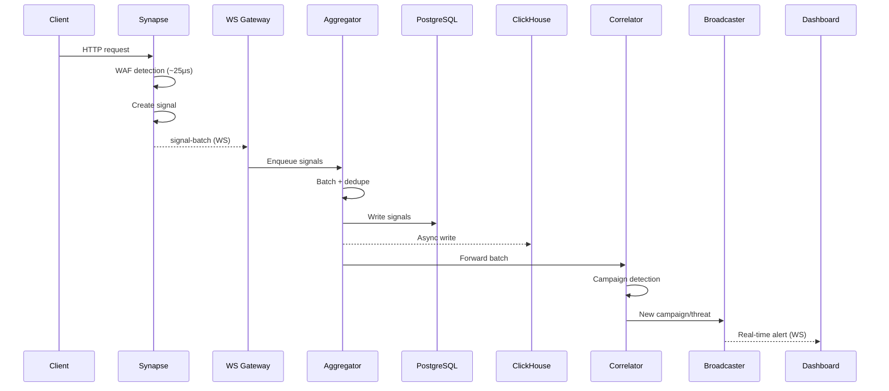
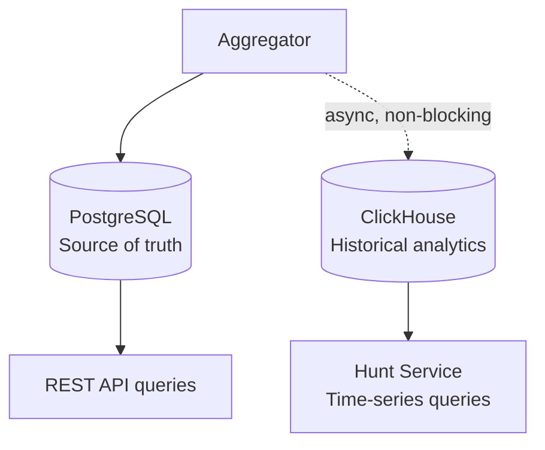
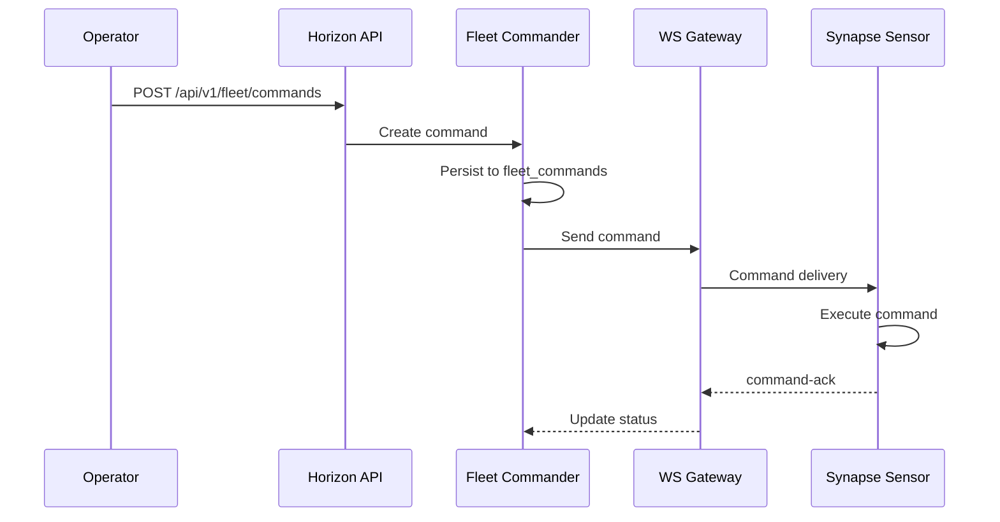
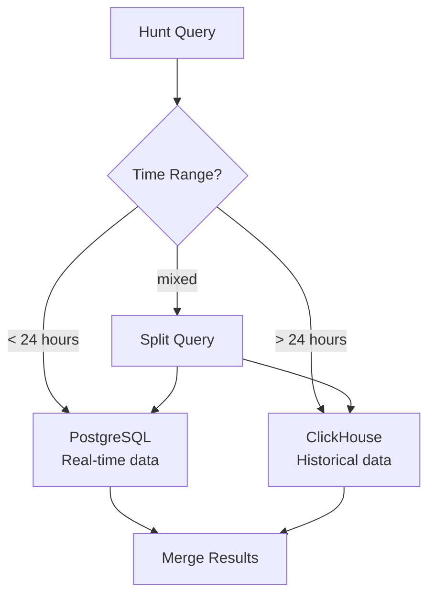

# Data Flow & Telemetry

This page documents how signals flow from a client request through Synapse detection to the Horizon hub and out to dashboards.

## End-to-End Signal Flow

## Ingest Pipeline

### 1. Signal Creation (Synapse)

When Synapse detects a threat or noteworthy event, it creates a signal containing:

- Signal type (e.g., `SQLI_DETECTED`, `RATE_LIMIT_EXCEEDED`, `DLP_MATCH`)
- Source IP and fingerprint
- Risk score and matched rules
- Request metadata (path, method, headers)

Signals are batched locally and sent to the Horizon hub via the WebSocket tunnel.

### 2. WebSocket Ingestion (Gateway)

Sensors authenticate to `/ws/sensors` using API keys with `signal:write` scope. The gateway supports:

- `signal` — single signal submission
- `signal-batch` — batch submission (preferred)
- `pong` — heartbeat response
- `blocklist-sync` — fleet blocklist synchronization

### 3. Aggregation

The Aggregator processes incoming signals with several strategies:

| Strategy | Description |
| --- | --- |
| **Batching** | Flushes at `SIGNAL_BATCH_SIZE` (default: 100) or `SIGNAL_BATCH_TIMEOUT_MS` (default: 5000 ms) |
| **Deduplication** | Merges signals by `signalType + (sourceIp OR fingerprint)` within the batch window |
| **Enrichment** | Adds tenant and sensor context to each signal |
| **Backpressure** | Max queue size prevents memory exhaustion under burst load |

### 4. Dual-Write Storage

- **PostgreSQL** is authoritative — all signals, state, and relationships
- **ClickHouse** receives async copies — failures do not block ingestion
- ClickHouse-dependent endpoints return HTTP 503 when ClickHouse is disabled

### 5. Correlation

The Correlator analyzes signal batches for cross-tenant patterns:

- Identifies coordinated attacks using anonymized SHA-256 fingerprints
- Creates `Campaign` objects grouping related signals
- Escalates campaigns when they cross severity thresholds

### 6. Broadcasting

The Broadcaster pushes real-time updates to connected dashboards:

- Dashboards connect to `/ws/dashboard` with `dashboard:read` scope
- Default subscriptions: `campaigns`, `threats`, `blocklist`
- Supports subscribe/unsubscribe for fine-grained topic control
- Auto-creates blocklist entries for high-severity threats

## Fleet Command Flow

Commands are persisted in PostgreSQL. If a sensor is offline, commands are queued and delivered when the sensor reconnects.

## Config and Rule Distribution

Rules are pushed to sensors using one of three strategies:

| Strategy | Behavior |
| --- | --- |
| `immediate` | Push to all sensors now |
| `canary` | Push to a subset first, promote after verification |
| `scheduled` | Push at a specified time |

Sync state is tracked per-sensor in `sensor_sync_state` and `rule_sync_state` tables.

## Hunt Query Routing

The Hunt Service routes queries based on their time window:

- **< 24 hours** — PostgreSQL for fresh, authoritative data
- **> 24 hours** — ClickHouse for historical time-series
- **Mixed ranges** — split at the 24h boundary, query both, merge results

## Metric Retention

| Category | Metrics | Retention | Resolution |
| --- | --- | --- | --- |
| **Traffic** | RPS, bandwidth, latency percentiles, status codes | 90 days | 1 minute |
| **Security** | Blocks, attacks, campaigns, risk scores | 1 year | Raw events |
| **Health** | CPU, memory, disk, connection count | 30 days | 1 minute |
| **API** | Endpoint stats, schema violations, discovery | 90 days | Raw events |

### Real-Time vs Historical Storage

| Real-Time (Redis) | Historical (ClickHouse) |
| --- | --- |
| Last 5 minutes of events | Full event archive |
| Live attack feeds | Trend analysis |
| Active session counts | Threat hunting queries |
| War Room state | Compliance reports |
| Sub-second query latency | Complex aggregations |
