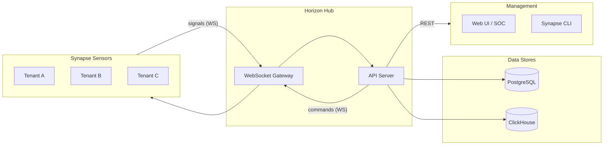
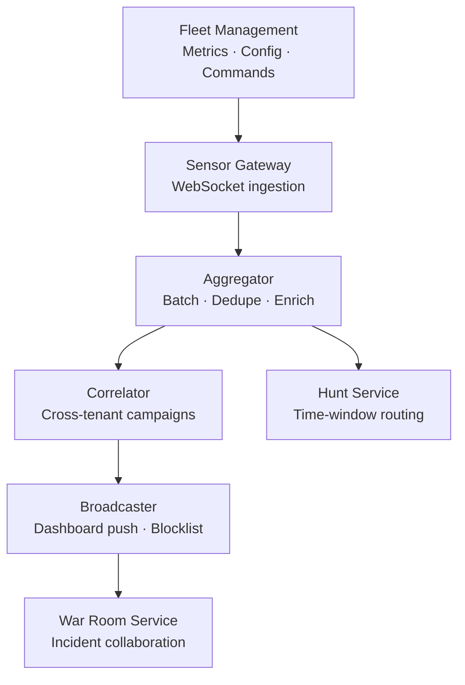

# Horizon Hub Architecture

Horizon is a multi-tenant hub that ingests threat signals from Synapse sensors, correlates them into campaigns, and distributes intelligence to dashboards and the fleet.

## System Overview

## Internal Services

| Service | Purpose |
| --- | --- |
| **Sensor Gateway** | Authenticates sensors, receives signals over `/ws/sensors` |
| **Aggregator** | Batches, deduplicates, and enriches signals with tenant/sensor context |
| **Correlator** | Detects cross-tenant campaigns using anonymized SHA-256 fingerprints |
| **Broadcaster** | Pushes real-time alerts to dashboards, auto-creates blocklist entries |
| **Hunt Service** | Routes time-based queries: <24h → PostgreSQL, >24h → ClickHouse |
| **War Room Service** | Incident collaboration, activity logging, `@horizon-bot` automation |
| **Fleet Management** | Sensor metrics, config template deployment, command orchestration |

## Multi-Tenant Model

- **Tenant-scoped data** — all rows have `tenantId` foreign keys in PostgreSQL
- **Fleet-wide data** — cross-tenant campaigns and blocklist entries use `tenantId = null`
- **Cross-tenant correlation** — uses anonymized fingerprints (SHA-256) to protect tenant identities
- **Fleet admin** — keys with `fleet:admin` scope can access fleet-wide intelligence

## Storage Strategy

### PostgreSQL (Source of Truth)

All signals, threats, campaigns, war rooms, and fleet state. Queries for dashboards and REST endpoints are backed by PostgreSQL.

### ClickHouse (Historical Analytics)

Optional. Used for time-series and high-cardinality queries. Writes are asynchronous — failures do not block signal ingestion. Enables hunt timelines, hourly stats, and longer retention windows.

### In-Memory Caches

- Blocklist cache for fast lookup and dashboard pushes
- Saved hunt queries (in-memory for demo/development mode)

## Reliability Patterns

| Pattern | Implementation |
| --- | --- |
| **Backpressure** | Aggregator enforces max queue size to prevent memory exhaustion |
| **Batching** | Flushes at `SIGNAL_BATCH_SIZE` or `SIGNAL_BATCH_TIMEOUT_MS` |
| **Deduplication** | Merges signals by `signalType + (sourceIp or fingerprint)` |
| **Dual-write** | PostgreSQL is authoritative; ClickHouse writes are non-blocking |
| **Heartbeat monitoring** | Sensors and dashboards have configurable heartbeat/ping timeouts |
| **Retry logic** | Aggregator batch retries; command sender retries with max attempts |
| **Graceful shutdown** | Services close WebSocket connections and flush pending batches |
| **Structured logging** | Pino across all services with consistent context |

## Security Model

### Authentication Layers

| Layer | Method | Lifetime |
| --- | --- | --- |
| **Sensor → Horizon** | mTLS + API key | Permanent (revocable) |
| **User → Dashboard** | OAuth 2.0 / SAML | Session-based |
| **API access** | API key + scopes | Configurable |
| **Dashboard session** | JWT | 60 minutes |

### Key Principles

- **API key auth** — keys stored as SHA-256 hashes, never plaintext
- **Scope enforcement** — each route checks required scopes (`signal:write`, `dashboard:read`, `fleet:admin`)
- **Tenant enforcement** — non-admin keys are filtered to their own tenant data

## UI Modules

The Horizon UI is organized into three navigation domains:

| Module | Domain | What It Contains |
| --- | --- | --- |
| **SYNAPSE** | Defense | Actors, campaigns, war rooms, threat hunting, global intel, session tracking |
| **BRIDGE** | Deployment | Sensor deploy, topology, canary, health, push rules |
| **BEAM** | Observability | Real-time metrics, traffic, latency, block rates, API catalog |
