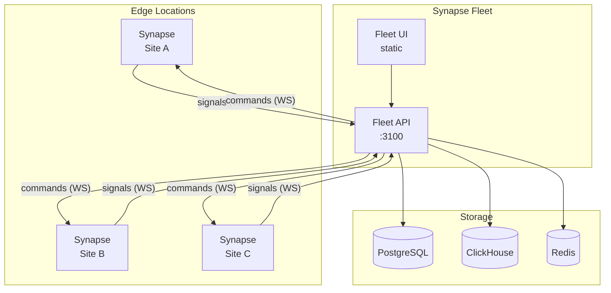

# Deployment

Choose a deployment model based on your needs. Start with
[Hosting Options](./hosting-options) if you are deciding between Docker, managed
hosting, static dashboard hosting, and Kubernetes.

| If you need | Deploy | Guide |
| --- | --- | --- |
| A fast WAF, nothing else | Synapse standalone | [Synapse Standalone](./synapse-standalone) |
| Fleet management + analytics | Synapse Fleet | [Deploy Synapse Fleet](./synapse-fleet) |
| Container orchestration | Kubernetes | [Kubernetes](./kubernetes) |
| Simple containerized setup | Docker Compose | [Docker](./docker) |
| Managed hosting or static UI hosting | Render, Fly.io, Vercel, Railway, Cloud Run | [Hosting Options](./hosting-options) |
| Maximum control | Bare metal / VM | [Docker](./docker) or [Synapse Standalone](./synapse-standalone) |

## Architecture at a Glance

::: info Synapse standalone
When running Synapse without Synapse Fleet, the sensor operates independently with a local YAML configuration. No hub connection required.
:::

## Before You Deploy

Review the [Production Checklist](./production) to ensure your environment is hardened, monitored, and ready for traffic.
