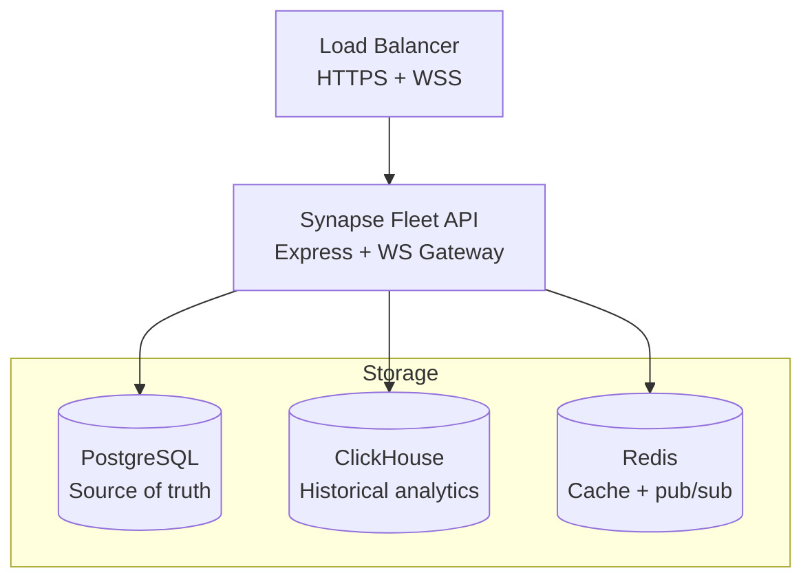

# Deploy Synapse Fleet

Synapse Fleet (formerly Signal Horizon) is the central intelligence hub. This guide covers deploying the API server, connecting databases, and registering Synapse sensors.

## Architecture



## Environment Configuration

Create a `.env` file for the Synapse Fleet API. All variables are set via environment. (Env var names still use the `HORIZON_*` prefix — renaming those is deferred per ADR-0003.)

### Server

| Variable | Default | Description |
| --- | --- | --- |
| `NODE_ENV` | `development` | `production` for deployed environments |
| `PORT` | `3100` | HTTP listener port |
| `HOST` | `0.0.0.0` | Bind address |
| `LOG_LEVEL` | `info` | `trace`, `debug`, `info`, `warn`, `error` |

### Database

| Variable | Default | Required | Description |
| --- | --- | --- | --- |
| `DATABASE_URL` | — | Yes | PostgreSQL connection string |
| `CLICKHOUSE_ENABLED` | `false` | No | Enable ClickHouse for historical queries |
| `CLICKHOUSE_HOST` | `localhost` | No | ClickHouse hostname |
| `CLICKHOUSE_HTTP_PORT` | `8123` | No | ClickHouse HTTP port |
| `CLICKHOUSE_DB` | `signal_horizon` | No | Database name |
| `CLICKHOUSE_USER` | `default` | No | Username |
| `CLICKHOUSE_PASSWORD` | — | No | Password |
| `CLICKHOUSE_COMPRESSION` | `true` | No | Enable compression |
| `CLICKHOUSE_MAX_CONNECTIONS` | `10` | No | Connection pool size |

### WebSocket

| Variable | Default | Description |
| --- | --- | --- |
| `WS_SENSOR_PATH` | `/ws/sensors` | Sensor ingestion endpoint |
| `WS_DASHBOARD_PATH` | `/ws/dashboard` | Dashboard push endpoint |
| `WS_HEARTBEAT_INTERVAL_MS` | `30000` | Heartbeat interval |
| `WS_MAX_SENSOR_CONNECTIONS` | `1000` | Max concurrent sensors |
| `WS_MAX_DASHBOARD_CONNECTIONS` | `100` | Max concurrent dashboards |

### Signal Processing

| Variable | Default | Description |
| --- | --- | --- |
| `SIGNAL_BATCH_SIZE` | `100` | Signals per aggregation batch |
| `SIGNAL_BATCH_TIMEOUT_MS` | `5000` | Max wait before flushing |
| `BLOCKLIST_PUSH_DELAY_MS` | `50` | Delay before broadcasting blocklist updates |
| `BLOCKLIST_CACHE_SIZE` | `100000` | In-memory blocklist capacity |

### Security

| Variable | Default | Description |
| --- | --- | --- |
| `API_KEY_HEADER` | `X-API-Key` | Header name for API key auth |
| `CORS_ORIGINS` | — | Comma-separated allowed origins |
| `CONFIG_ENCRYPTION_KEY` | — | Encryption key for sensitive config fields |
| `TELEMETRY_JWT_SECRET` | — | JWT secret for sensor telemetry auth |

## Database Setup

### PostgreSQL

Run Prisma migrations to create the schema:

```sh
cd apps/signal-horizon/api
pnpm prisma migrate deploy
```

### ClickHouse (Optional)

Apply the ClickHouse schema if enabled:

```sh
clickhouse-client --host localhost \
  --query "$(cat apps/signal-horizon/clickhouse/schema.sql)"
```

Key tables: `signal_events`, `campaign_timeline`, `signal_hourly_mv` (materialized view).

## Starting the Server

### Native

```sh
cd apps/signal-horizon/api
NODE_ENV=production node dist/server.js
```

With PM2 for process management:

```sh
pm2 start dist/server.js --name horizon -i max
```

### Docker

See the [Docker guide](./docker) for containerized deployment.

## Registering Sensors

Create a sensor via the REST API:

```sh
curl -X POST https://horizon.example.com/api/v1/fleet/sensors \
  -H "Authorization: Bearer $ADMIN_TOKEN" \
  -H "Content-Type: application/json" \
  -d '{"name": "US East Primary", "region": "us-east-1"}'
```

The response includes a sensor ID and authentication token. Configure the Synapse instance to connect:

```yaml
# In Synapse config.yaml
telemetry:
  enabled: true
  horizon_url: "wss://horizon.example.com/ws/sensors"
  sensor_id: "sensor-abc123"
  token: "sensor-token-xyz789"
```

## Health Endpoints

| Endpoint | Description |
| --- | --- |
| `GET /health` | Basic health check |
| `GET /health/ready` | Readiness probe (DB connections verified) |
| `GET /health/live` | Liveness probe |

## Monitoring

Enable Prometheus metrics:

```sh
METRICS_ENABLED=true
METRICS_PORT=9090
```

Key metrics: `signal_horizon_sensors_total`, `signal_horizon_ws_connections`, `signal_horizon_query_duration_seconds`.

## High Availability

- **PostgreSQL:** Use streaming replication with a read replica
- **Horizon API:** Scale horizontally behind a load balancer with sticky sessions (WebSocket affinity)
- **Redis:** Required for shared state across multiple API instances
- **ClickHouse:** Use ReplicatedMergeTree for data durability
